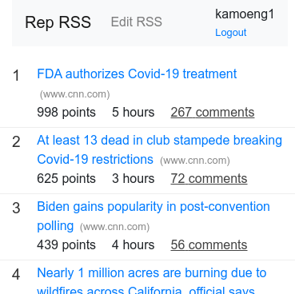

## Rep RSS

RSS with Twitter and Hatena Bookmark reputation.

Hosted at https://ancient-shelf-27599.herokuapp.com/ .



## How to build

Install node.js and yarn.

Install PostgreSQL.

```
sudo apt install postgresql-10
```

Change password of PostgreSQL (or change password in ``sequelize-loader.ts``).

```
$ sudo su - postgres
$ psql
postgres=# alter role postgres with password 'postgres';
```

And create ``rep_rss`` DB.

```
postgres=# create database rep_rss;
postgres=# \q
```

Install packages.

```
yarn install
```

You need Twitter's developer account. Please get your API key (CONSUMER_KEY) and API secret key (CONSUMER_SECRET).

Also register ``http://127.0.0.1:3000/auth/twitter/callback`` and ``http://127.0.0.1:8080/auth/twitter/callback`` as Callback URL of your Twitter App.

### Development

First, you must build files.

```
$ yarn build
```

Then run with environment variables.

```
CONSUMER_KEY="YOUR_CONSUMER_KEY" CONSUMER_SECRET="YOUR_CONSUMER_SECRET" SITE_URL="http://127.0.0.1:8080/" APP_HASH_KEY="YOUR_CHOSEN_APP_HASH_KEY" APP_ENC_KEY="YOUR_CHOSEN_APP_ENC_KEY" SESSION_SECRET="YOUR_CHOOSING_SESSION_SECRET" yarn dev
```

## Deploy to Heroku

Prerequisite.

```
$ heroku login -i
$ heroku create
$ heroku addons:create heroku-postgresql:hobby-dev
```

First, create ``.env`` file in the repository's root directory.

```env.
CONSUMER_KEY="YOUR_CONSUMER_KEY"
CONSUMER_SECRET="YOUR_CONSUMER_SECRET"
SITE_URL="HEROKU_SITE_URL"
APP_HASH_KEY="YOUR_CHOOSING_APP_HASH_KEY"
APP_ENC_KEY="YOUR_CHOOSING_APP_ENC_KEY"
SESSION_SECRET = "YOUR_CHOOSING_SESSION_SECRET"
```

Push config to Heroku.

```
$ heroku plugins:install heroku-config
$ heroku config:push
```

Push code to Heroku.

```
$ git push heroku master
```

